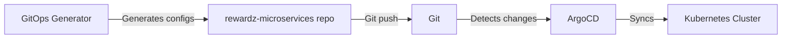

# GitOps Generator

## Overview

The GitOps Generator is a Node.js application designed to generate Kubernetes deployment configurations for the rewardz-microservices repository. It automates the creation of Helm chart files that define infrastructure as code, which are then used by ArgoCD to manage deployments.

## GitOps Workflow

1. GitOps Generator creates/updates Kubernetes configuration in rewardz-microservices repository
2. Changes are committed and pushed to rewardz-microservices
3. ArgoCD detects changes and automatically syncs the cluster state
4. Kubernetes deploys/updates the services based on the new configuration



## Features

- Dynamically generates Helm chart files for microservices deployment with GitOps approach
- Supports both static and dynamic deployment configurations
- Automatic dependency management for supported services
- Templated configurations for PostgreSQL and Redis
- Customizable deployment paths

## Deployment Types

### Static Deployments
- Used for permanent environments like dev and prod
- Configurations persist in the repository
- Located in `apps/<service-name>/<environment>/`
- Managed long-term by ArgoCD
- Examples: production, staging, development environments

### Dynamic Deployments
- Used for temporary feature branch deployments
- Located in `temporary/<namespace>/<service-name>/`
- Automatically cleaned up after 24-48 hours
- Perfect for testing feature branches
- Examples: feature testing, PR reviews, temporary deployments

## Supported Services

| Service         | Dependencies         |
|-----------------|----------------------|
| cerra-gen-ai    | PostgreSQL, Redis    |
| auto-approver   | PostgreSQL           |
| landing-page    | Basic microservice   |
| frontend-app    | Basic microservice   |

## Project Structure

```
gitops-generator
├── src/
│   ├── generators/
│   │   ├── __tests__/         # Test files
│   │   ├── chart.js
│   │   ├── values.js
│   │   ├── defaults.js
│   │   └── dependencies.js
│   ├── __tests__/            # Application tests
│   ├── constants.js
│   └── app.js
├── .eslintrc.js              # ESLint configuration
├── .gitignore                # Git ignore rules
├── jest.config.js            # Jest configuration
├── package.json
└── README.md
```

## Usage

```bash
node src/app.js \
  --service-name <service-name> \
  --namespace <namespace> \
  --environment <env> \
  --type <type> \
  [--config-path <path>] \
  [--output-path <path>]
```

### Parameters

- `service-name`: Name of the microservice (e.g., cerra-gen-ai, auto-approver)
- `namespace`: Kubernetes namespace
- `environment`: Target environment (dev, prod, etc.)
- `type`: Deployment type (static or dynamic)
- `config-path`: (Optional) Path to environment-specific configuration file
- `output-path`: (Optional) Base directory for generated files. Defaults to current directory.

### Output Structure

- Static deployments: `apps/<service-name>/<environment>/`
- Dynamic deployments: `temporary/<namespace>/<service-name>/`

### Generated Files

- `Chart.yaml`: Helm chart definition with auto-configured dependencies
- `values.yaml`: Environment-specific configuration with dependency settings
- `values.default.yaml`: Default configuration values

## Dependencies

Currently supports automatic configuration for:
- PostgreSQL (Bitnami chart v12.12.10)
- Redis (Bitnami chart v20.11.5)
- Microservice (Rewardz chart v0.1.0)

## Examples

```bash
# Generate static environment files
npm run generate-static-env

# Generate feature branch environment files
npm run generate-feature-env

# Generate with custom parameters
node src/app.js \
  --service-name custom-service \
  --namespace custom-ns \
  --environment prod \
  --type static \
  --config-path ./configs/prod.yaml \
  --output-path ./custom-output
```

## Development

### Quick Start

```bash
# Install dependencies
npm install

# Generate example files
npm run generate-static-env

# Check generated files in ./generated-files directory
ls -la ./generated-files
```

### Setup

```bash
# Install dependencies
npm install

# Run linting
npm run lint

# Fix linting issues automatically
npm run lint:fix

# Run tests
npm test

# Run tests in watch mode
npm run test:watch

# Run tests with coverage report
npm run test:coverage
```

### Pre-commit Hooks

The project uses Husky and lint-staged to run checks before each commit:
- Automatically runs ESLint on staged files
- Runs related tests for changed files
- Prevents commit if either linting or tests fail
- Auto-fixes formatting issues when possible

The pre-commit hook will only check files that are staged for commit, making the process faster than checking the entire codebase.

### Linting

The project uses ESLint with recommended rules and additional customizations:
- Enforces semicolons
- Requires single quotes
- Warns about console usage
- Warns about unused variables

### Testing

Tests are written using Jest and can be found in `__tests__` directories. The test suite includes:
- Unit tests for core functionality
- Coverage reporting
- Watch mode for development

Current test coverage:
- Statements: 100%
- Branches: 50%
- Functions: 100%
- Lines: 100%

## Contributing

1. Ensure all tests pass: `npm test`
2. Ensure code follows linting rules: `npm run lint`
3. Add tests for any new functionality
4. Update documentation as needed

## License

This project is licensed under the MIT License. See the LICENSE file for details.